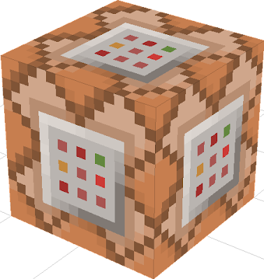

# About

[FR] Simple plugin configurable comportant plusieurs commandes | Plugin en developpement, d'autres commandes seront rajoutés par la suite

[ENG] Simple configurable plugin with several commands | Plugin in development, other commands will be added later

-----------------

## Requires

[InvMenu plugin](https://github.com/Muqsit/InvMenu)

-----------------

### Base configuration

    # Setup here the prefix for the plugin
    Prefix: "§5[§bSimpleCommands§5] §r"
    
    # Setup here the message when player don't have permission to execute this command
    ErrorPermission: " You don't this permission to use this command"
    
    # Setup here message on feed command
    Feed:
        confirm: " Your food has been regenerated"
        error: " You canno't actually regenerate your food"
    # Setup here message on heal command
    Heal:
        confirm: " Your life has been regenerated"
        error: " You canno't actually regenerate your life"
    
    # Setup here message for furnace command
    Furnace:
        errorItemInHand: " This item can not be furnace"
        noblockInHand: " You must have any items in your hand"
        confirmFurnace: " You have furnace {count} {item}"
    
    Clear:
        enderChest:
            confirm: " You have clear {player} enderchest"
            send: " {player} has clear your enderchest"
        inv:
            confirm: " You have clear {player} inventory"
            send: " {player} has clear your inventory"

-----------------

### Feed

Permission:  

    use.feed

-----------------

### Heal

Permission:

    default: Op
    use.heal

-----------------

### Invclear | enderinvclear

Permission:

    default: Op
    use.clearinv

-----------------

### invsee | enderinvsee

Permission:

    default: Op
    use.invsee

-----------------

### Furnace

Permission:

    default: Op
    use.furnace

Block can be furnace:

    - all ores
    - sand
    - all food
    - sponge

-----------------

## Credit

[FR] N'hésitez pas à donner votre avis sur le plugin et sur quoi il peut être amélioré

[ENG] Feel free to give your opinion on the plugin and on what it can be improved

-----------------

## Contact

[discord] achedon12#0034

[my minecraft server](https://discord.gg/gmEyCzUJg2)

[my github](https://github.com/leoderoin)

[my discord shop](https://discord.gg/Mnc6SMr9zB)